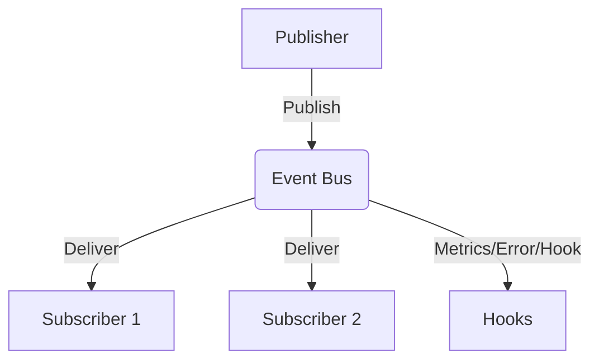
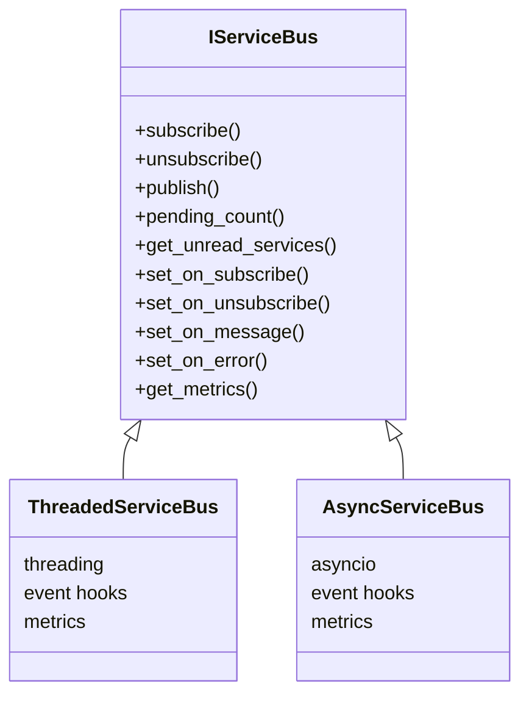

# eventflowsys – Documentation

A modular, extensible event bus and logger system for Python.

---

## Installation

```
pip install eventflowsys
```

---

## Modules & Classes

### 1. LoggerInjectable (logger_Injectable.py)
- **Purpose:** Abstract base class for logger injection, using loguru.
- **Usage:**
    ```python
    from eventflowsys import LoggerInjectable
    class MyService(LoggerInjectable):
        def perform_action(self):
            self.logger.info("Action performed!")
    ```
- **Custom logger:** Pass a custom logger or log path to the constructor.

### 2. ThreadedServiceBus (bus/thread_bus.py)
- **Purpose:** Thread-safe event bus for synchronous applications.
- **Key Methods:**
    - `subscribe(group, service_name, callback)`
    - `unsubscribe(group, service_name)`
    - `publish(group, data, priority=0, ttl=None, broadcast=False)`
    - `pending_count()`
    - `get_unread_services(msg_id)`
    - `set_on_subscribe/hook` (event hooks)
    - `get_metrics()`
- **Features:**
    - Group-based subscriptions
    - Message priority & TTL
    - Broadcast support
    - Metrics & unread tracking
    - Event hooks for extensibility

### 3. AsyncServiceBus (bus/async_bus.py)
- **Purpose:** Asyncio-based event bus for coroutine-based applications.
- **Key Methods:**
    - `subscribe(group, service_name, callback)` (async)
    - `unsubscribe(group, service_name)` (async)
    - `publish(group, data, priority=0, ttl=None, broadcast=False)` (async)
    - `pending_count()` (async)
    - `get_unread_services(msg_id)` (async)
    - `set_on_subscribe/hook` (event hooks)
    - `get_metrics()`
- **Features:**
    - Async group-based subscriptions
    - Message priority & TTL
    - Broadcast support
    - Metrics & unread tracking
    - Event hooks for extensibility

### 4. Base Interfaces & Errors (bus/base_bus.py)
- **IServiceBus:** Abstract base class for event bus implementations.
- **Message:** Data class for messages (priority, group, data, expiration).
- **Custom Errors:**
    - `ServiceBusError`, `SubscriptionError`, `MessageNotFoundError`, `GroupNotFoundError`

---

## Example: Threaded Bus
```python
from eventflowsys import ThreadedServiceBus
bus = ThreadedServiceBus()
def callback(msg_id, data):
    print(f"Received: {data}")
bus.subscribe("group1", "serviceA", callback)
bus.publish("group1", "hello world")
```

## Example: Async Bus
```python
from eventflowsys import AsyncServiceBus
import asyncio
async def main():
    bus = AsyncServiceBus()
    async def callback(msg_id, data):
        print(f"Received: {data}")
    await bus.subscribe("group1", "serviceA", callback)
    await bus.publish("group1", "hello async world")
asyncio.run(main())
```

## Example: LoggerInjectable
```python
from eventflowsys import LoggerInjectable
class MyService(LoggerInjectable):
    def perform_action(self):
        self.logger.info("Action performed!")
service = MyService()
service.perform_action()
```

---

## Advanced Usage Examples

### Custom Event Hooks
You can register hooks to observe or extend bus behavior:

```python
def on_subscribe(group, service_name):
    print(f"Service {service_name} subscribed to {group}")
def on_message(msg_id, group, data):
    print(f"Message {msg_id} delivered to {group}: {data}")
bus = ThreadedServiceBus()
bus.set_on_subscribe(on_subscribe)
bus.set_on_message(on_message)
bus.subscribe("group1", "svc", lambda i, d: None)
bus.publish("group1", "test")
```

### Custom Error Handling
Handle errors gracefully by registering an error hook:

```python
def on_error(error):
    print(f"Error occurred: {error}")
bus.set_on_error(on_error)
try:
    bus.subscribe("group1", "svc", None)  # Not callable, triggers error
except Exception:
    pass
```

### Integration Scenario: LoggerInjectable with Event Bus
Inject a logger into a service that subscribes to the bus:

```python
class LoggingService(LoggerInjectable):
    def perform_action(self, msg_id, data):
        self.logger.info(f"Received: {data}")
service = LoggingService()
bus.subscribe("group1", "svc", service.perform_action)
bus.publish("group1", "integrated logging!")
```


## Architecture & Flow Diagrams

### Event Flow (Threaded/Async Bus)


### Bus Architecture Overview


### Logger Injection Flow
```mermaid
flowchart TD
    S[Service (LoggerInjectable)] -- uses --> L[Logger (loguru)]
    S -- logs to --> F[File/Console]
```
---

## API Reference Tables

### ThreadedServiceBus & AsyncServiceBus

| Method | Parameters | Return Type | Description |
|--------|------------|-------------|-------------|
| subscribe | group: str, service_name: str, callback: Callable | None | Subscribe a service to a group. |
| unsubscribe | group: str, service_name: str | None | Unsubscribe a service from a group. |
| publish | group: str, data: Any, priority: int = 0, ttl: Optional[float] = None, broadcast: bool = False | int or list[int] | Publish a message to a group or all groups. |
| pending_count |  | int | Return the number of pending messages. |
| get_unread_services | msg_id: int | set[str] or None | Get services that have not read a message. |
| set_on_subscribe | hook: Callable | None | Register a hook for subscribe events. |
| set_on_unsubscribe | hook: Callable | None | Register a hook for unsubscribe events. |
| set_on_message | hook: Callable | None | Register a hook for message delivery events. |
| set_on_error | hook: Callable | None | Register a hook for error events. |
| get_metrics |  | dict | Get bus metrics (delivered, failed, pending, expired). |

### LoggerInjectable

| Method | Parameters | Return Type | Description |
|--------|------------|-------------|-------------|
| __init__ | logger: Optional, log_path: Optional | None | Initialize with optional custom logger or log path. |
| perform_action |  | None | Abstract method to be implemented by subclasses. |

### Message (bus/base_bus.py)

| Attribute | Type | Description |
|-----------|------|-------------|
| priority | int | Message priority (lower = higher priority) |
| msg_id | int | Unique message identifier |
| group | str | Target group |
| data | Any | Message payload |
| expiration | float or None | Expiration timestamp |

### Custom Errors

| Error Class | Description |
|-------------|-------------|
| ServiceBusError | Base exception for bus errors |
| SubscriptionError | Raised for subscription problems |
| MessageNotFoundError | Raised if a message ID is not found |
| GroupNotFoundError | Raised if a group does not exist |
---

---

## Testing

Tests are provided for all major features in the `tests/` directory. Use `pytest` to run the test suite:

```
pytest
```

---

## Contributing

Contributions are welcome! Please open issues or pull requests for bug fixes, new features, or documentation improvements.

---

## License

MIT License
